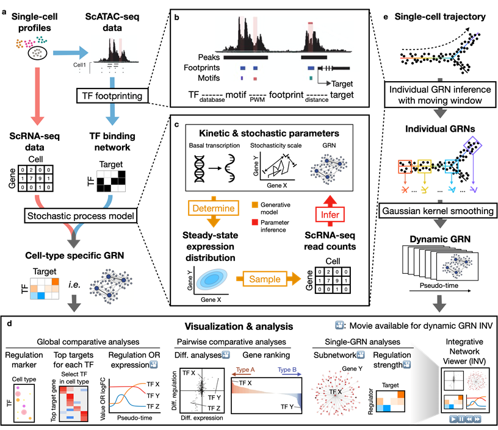

=========
Dictys
=========
.. image:: https://img.shields.io/pypi/v/dictys?color=informational
   :target: https://pypi.python.org/pypi/dictys

TBA: copy abstract.

Overview

Installation
=============
Dictys depends on multiple softwares. Creating an `Anaconda <https://www.anaconda.com/>`_ environment can resolve the dependencies easily. We also provide docker and singularity containers (WHERE?). Dictys can be installed from `PyPI <https://pypi.org/project/dictys>`_ with: ``pip install dictys``, but it does not auto-resolve some dependencies.

To install Dictys with Anaconda:

.. code-block::

	#Install non-pypi dependencies
	conda create -y -n dictys_env_name -c bioconda -c conda-forge -c pytorch pytorch torchvision torchaudio cudatoolkit=11.3 bedtools homer samtools macs2
	. activate dictys_env_name
	#Install pypi dependencies
	pip install numpy pandas docutils h5py pyro-ppl==1.6.0 scipy networkx pybedtools pyDNase threadpoolctl joblib matplotlib jupyter
	#Install Dictys
	pip install git+https://github.com/pinellolab/dictys.git
	conda deactivate

For install questions, see `INSTALL.md`.

If you need `STREAM <https://github.com/pinellolab/STREAM>`_, `ArchR <https://www.archrproject.com/>`_, or other softwares upstream of Dictys, we recommend to install them in separate environments following their instructions.

Usage
=====
Dictys contains two major functions: network inference and network analysis. Network inference contains multiple command-line steps which are summarized in a `make` based pipeline. Network analysis can be achieved purely in jupyter notebooks. Both functions have examples in the `examples` folder.

Issues
==========================
Pease raise an issue on `github <https://github.com/pinellolab/dictys/issues/new>`_.

References
==========================
TBA

FAQ
==========================
TBA
TBA
